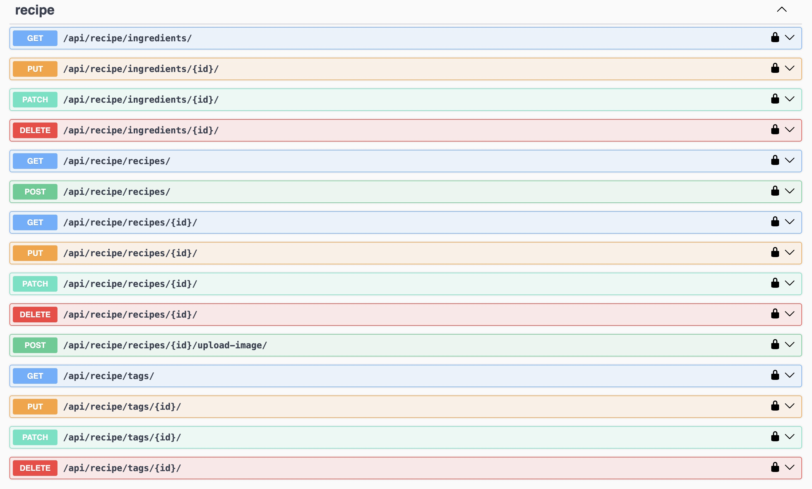
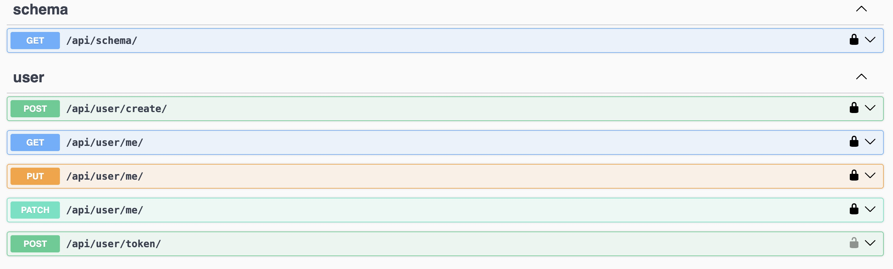
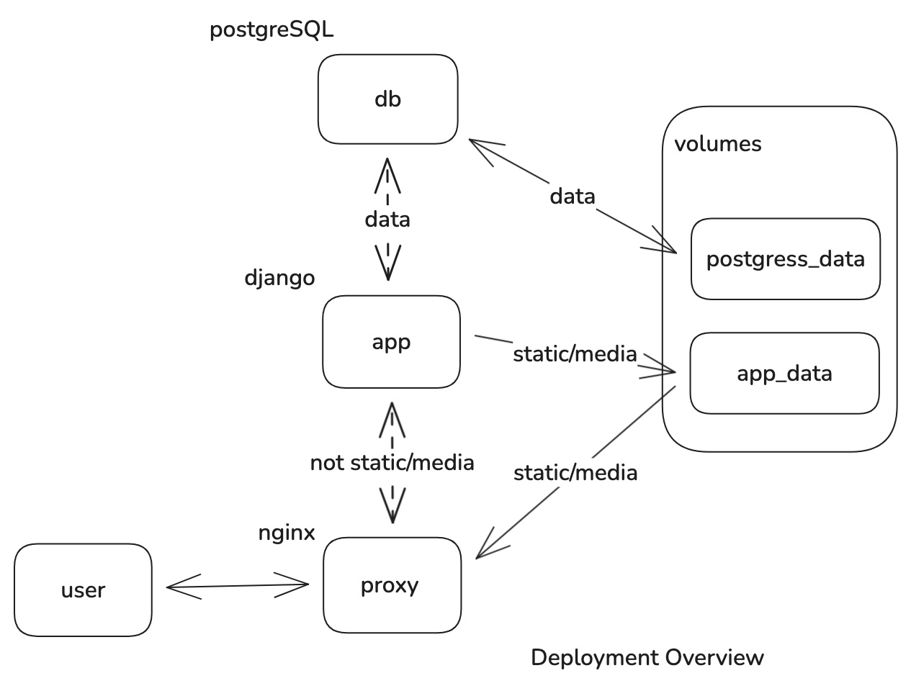

This repository contains practice code based on the Udemy course [Build a Backend REST API with Python & Django - Advanced](https://www.udemy.com/course/django-python-advanced/).

While the basic application logic follows the course material, the setup and tooling differ from 
the original instructions in order to focus on learning instead of setup. 

Key differences from the course setup:

* Runs directly on the local environment rather than using `Docker`
* Uses Django's default `SQLite` database instead of `PostgreSQL`
* Uses `ruff` for linting instead of `flake8`
* Adds `mypy` and `django-stubs` for static type checking

[](https://github.com/asarkar/udemy-django-python-advanced/actions)

## App Design


## Features

* 19 API Endpoints
  * Managing users, recipes, tags, ingredients
* User Authentication
* Browsable Admin Interface (Django Admin)
* Browsable API (Swagger)

## API Endpoints




## Technologies

**Python**
* Programming Language
* Foundation of our API

**Django**
* Python Web Framework
* Handles
  * URL Mappings
  * Object Relational Mapper
  * Admin site

**Django REST Framework**
* Django add-on

**uv**
* Python package and project manager

~~**PostgreSQL**~~
* Database

~~**Docker**~~
* Containerization Software
* Development environment
* Deployment

**Swagger**
* Documentation
* Browsable API (testing)

**GitHub Actions**
* Automation
  * Testing and Linting

## Django Project Structure
```
app/ - Django project
├── app/core/ - Code shared between multiple apps
├── app/user/ - User related code
└── app/recipe/ - Recipe related code
```

## Syllabus
1. Introduction
2. App Design
3. Test Driven Development
4. System Setup
5. Project Setup
6. Configure GitHub Actions
7. Test Driven Development with Django
8. Configure Database
9. Create User Model
10. Setup Django Admin
11. API Documentation
12. Build user API
13. Build recipe API
14. Build tags API
15. Build ingredients API
16. Recipe images API
17. Implement filtering
18. Deployment
19. Summary
20. Upgrades

## Development

### Environment Setup

**Download all dependencies**
```
% uv sync
```
**Manually activate venv**
```
% source ./.venv/bin/activate
```

**Deactivate venv**
```
% deactivate
```

### Django Management Commands

Because we use `uv` to manage Python execution, any direct invocation of commands such as `python`, 
`django-admin`, or other executables is replaced with `uv run`. This ensures that all tools run 
within the environment managed by `uv`.

Rather than navigating into the project directory to run management commands, we run all commands 
from the **repository root**, and pass the project directory using the `--directory` flag.

For example, what would normally be executed as:
```
app% python manage.py migrate
```

becomes:
```
% uv run --directory app manage.py migrate
```

`uv` will "search upwards" from a given directory until it finds `pyproject.toml`, `.venv`, or `uv` 
configuration files. A directory containing any of these files is considered the project root. `uv` 
will use a `.venv/` if found in the root.

Thus, running a command like `uv run --directory app python -c "import sys; print(sys.executable)"` 
doesn't require manual activation of venv.

**Create a new Django project**:
```
django-admin startproject app
```

**Create a new Django application**:
```
python manage.py startapp core
```

**Apply all database migrations**:
```
python manage.py migrate
```

**Create migrations for the `core` app**:
```
python manage.py makemigrations core
```

**View the SQL statements that will be executed with the first migration**:
```
python manage.py sqlmigrate core 0001
```

**Run the Django development server**:
```
python manage.py runserver
```

**Run the development server specifying host/port and settings file**:
```
python manage.py runserver 127.0.0.1:8001 --settings=app.settings
```

**Run the Django shell**:
```
python manage.py shell
```

**Create a superuser**:
```
python manage.py createsuperuser
```

**Dump the database into a JSON file**:
```
python manage.py dumpdata auth core --indent 2 > core/fixtures/core.json
```

**Seed the database from a JSON file**:
```
python manage.py loaddata core/fixtures/core.json
```

**Delete all data from all tables**:
```
python manage.py flush --noinput
```

**Run custom management command**:
```
python manage.py seed_users
```

### Testing

**Run tests**
```
% ./.github/run.sh <chapter_directory>
```

## Deployment



### Docker

**Nuclear option, delete everything**
```
docker system prune -a --volumes -f
```

**Build and run**
```
docker compose -f docker/docker-compose.yml up --build
```
